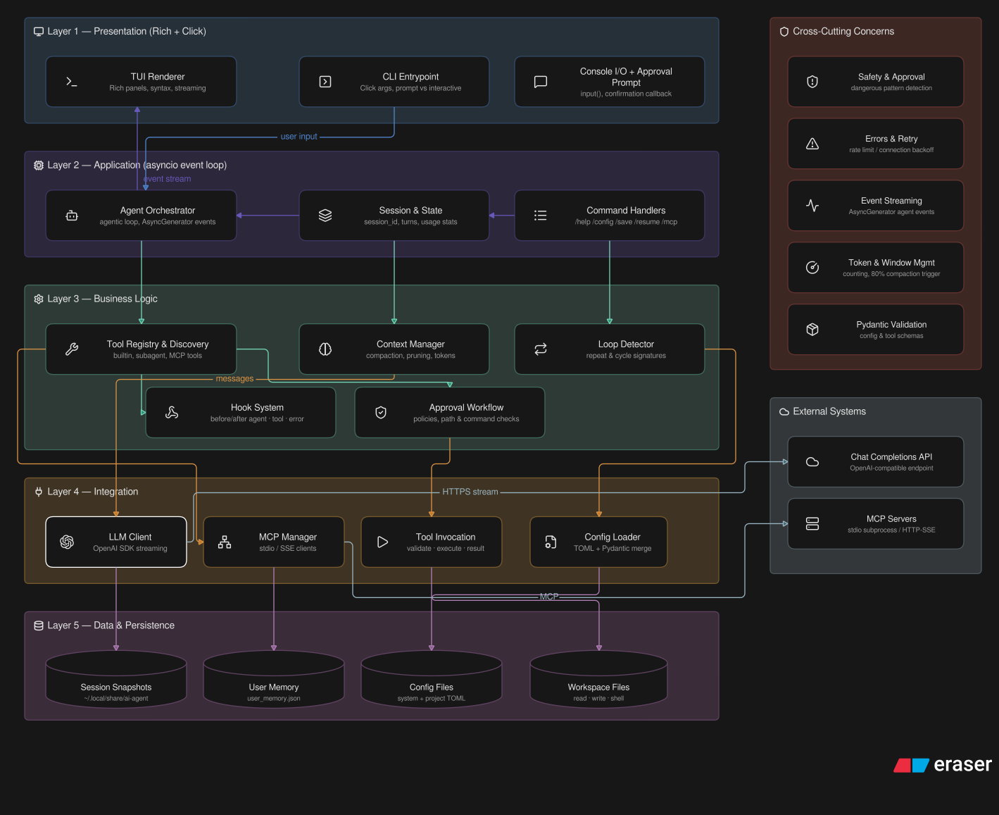
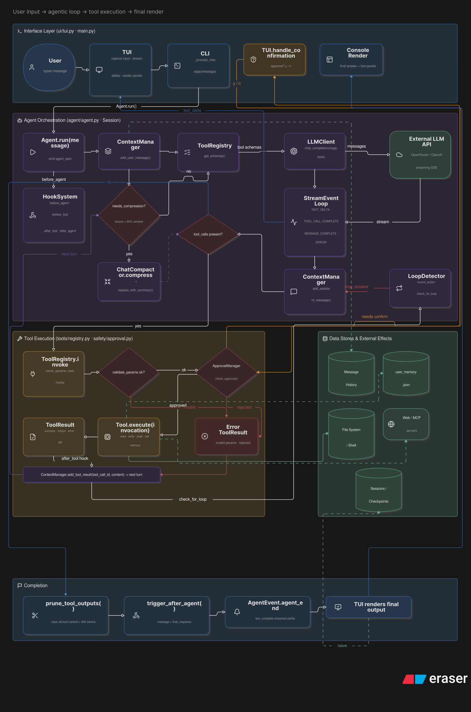
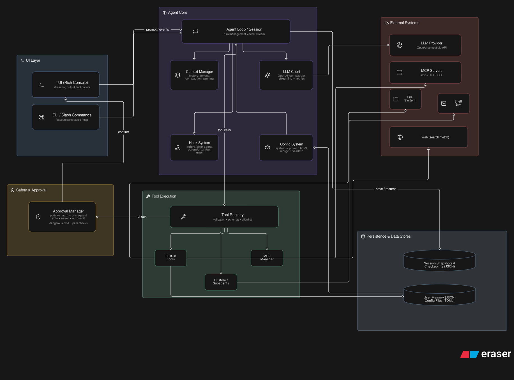

Thoth is a simple TUI based coding assistant.

The core idea is simple, user prompts the LLM, and based on what the ask is, it decides what to do, i.e. a tool call, or execute a shell command etc.

For an overview, Thoth just contains bunch of Pydantic models, which are validated, and then execution is done. If the trace is made accurately, things are quite simple to understand.

# Installation
Installation can be done very easily. Thoth is easily available after step 1, however, if you want to use more features, like MCP, or even specify model of your choice, you need to provide your own configuration (step 2).

## Initial Setup (Step 1)
```bash
git clone https://github.com/manmohak07/Thoth

cd Thoth && pip install -r requirements.txt

export API_KEY=<your_api_key>
export BASE_URL=<your_base_url>
```

And that's it! You are all set to use it. For more advanced features, you can provide your own configuration.

A user can have TWO TYPES OF CONFIGS
1. A GENERIC config
  `~/.config/ai-agent/config.toml`
2. A PROJECT SPECIFIC config 
  `<path to Thoth>/.ai_agent/config.toml`

The second one, i.e. the project specific config is prioritised and shall override the generic one. Below is example of how it shall look like.

## Project Specific Configuration (Step 2)
```bash
cd Thoth

mkdir .ai-agent && cd .ai-agent && touch config.toml
```

### Once the `config.toml` file is ready, you can specify your own configs. Below are some examples.

### Model Config
```bash
[model]
name = "model-name"
temperature = 0 # 0.0 to 1.0
```

### Hook Config
```bash
[[hooks]]
name="any-name"
# (any one trigger based on your use case)
trigger= "before_agent" OR 
         "after_agent"  OR
         "before_tool"  OR
         "after_tool"   OR
         "on_error"
cmd='python3 Thoth/scripts/your-script.py'
```

### MCP Config (look for MCP servers online and specify accordingly)
```bash
[mcp_servers.filesystem]
command = "npx"
args = ["-y", "@modelcontextprotocol/server-filesystem","path to Thoth", "."]
```

## Project Structure
```
├── agent
│   ├── agent.py
│   ├── events.py
│   ├── persistence.py
│   └── session.py
├── client
│   ├── llm_client.py
│   └── response.py
├── config
│   ├── config.py
│   ├── loader.py
├── context
│   ├── compression.py
│   ├── context_manager.py
│   ├── loop_detection.py
├── hooks
│   └── system.py
├── main.py
├── prompts
│   └── system.py
├── README.md
├── safety
│   ├── approval_manager.py
├── tools
│   ├── base.py
│   ├── builtin
│   │   ├── edit_file.py
│   │   ├── glob.py
│   │   ├── grep.py
│   │   ├── __init__.py
│   │   ├── list_dir.py
│   │   ├── memory.py
│   │   ├── read_file.py
│   │   ├── shell.py
│   │   ├── todo.py
│   │   ├── web_fetch.py
│   │   ├── web_search.py
│   │   └── write_file.py
│   ├── discovery.py
│   ├── mcp
│   │   ├── client.py
│   │   ├── manager.py
│   │   ├── mcp_tool.py
│   ├── registry.py
│   └── subagents.py
├── ui
│   └── tui.py
└── utils
    ├── errors.py
    ├── paths.py
    └── text.py
```


## Config

- ```config.py```
Contains the project's main configuration definitions and acts as the central source for settings used throughout the codebase. It defines configurations for models, shell environments, MCP servers, and approval policies.

- ```loader.py```
Loads configuration files from both system and project locations and merges them into a single configuration. Project-specific settings override the default system configuration.

## Agent (agent)

- ```agent.py```
Implements the main agent and coordinates interactions between the user, the language model, and the available tools. It also manages the agent loop and message flow.

- ```events.py```
Defines the events used throughout the agent lifecycle, including text streaming, tool execution, and other internal events.

- ```persistence.py```
Handles session persistence by saving and restoring session snapshots and related state.

- ```session.py```
Creates and manages a session by initializing components such as the language model client, context manager, tool registry, and approval manager.

## Client (client)

- ```llm_client.py```
Handles communication with the language model. It manages requests, retries, response streaming, and other client-related operations.

- ```response.py```
Defines the structures used to process model responses, including streaming events, token usage, and tool calls.

## Tools (tools)

- ```base.py```
Defines the base tool implementation and the common structures shared by all tools.

- ```registry.py```
Manages the registration and retrieval of tools available to the agent.

- ```subagents.py```
Defines specialized agents that can be used as tools for handling specific tasks.

- ```discovery.py```
Discovers and loads custom tools from configured directories.

## tools/mcp

- ```client.py```
Manages connections between the agent and MCP servers.

- ```manager.py```
Coordinates MCP clients and handles the registration of MCP-based tools.

- ```mcp_tool.py```
Implements the MCP tool and provides functionality for executing MCP-specific operations.

## tools/builtin

- ```edit_file.py```
Edits files by replacing specific text patterns while ensuring that only the intended sections are modified.

- ```glob.py```
Searches for files that match a glob pattern and supports recursive directory traversal.

- ```grep.py```
Searches for patterns within files and returns matching results along with their locations.

- ```list_dir.py```
Lists the contents of directories and provides options for handling hidden files.

- ```memory.py```
Stores and retrieves persistent information such as user preferences, notes, and contextual data.

- ```read_file.py```
Reads text files and supports line ranges to handle large files more efficiently.

- ```shell.py```
Executes shell commands while applying safety checks to block potentially dangerous operations.

- ```todo.py```
Maintains a session-level task list and provides functionality for adding, updating, listing, and clearing tasks.

- ```web_fetch.py```
Retrieves content from a URL and returns the response as plain text.

- ```web_search.py```
Performs web searches and returns matching results with titles, links, and descriptions.

- ```write_file.py```
Creates new files or writes content to existing files.

## Context (context)

- ```compression.py```
Compresses conversation history to reduce token usage and manage context size.

- ```context_manager.py```
Maintains the conversation context, including messages, token usage, and context updates.

- ```loop_detection.py```
Detects repeated agent actions to prevent infinite execution loops.

## UI (/ui)

- ```tui.py```
Implements the terminal interface and manages user input, message rendering, and console interactions.

## Hooks (/hooks)

- ```system.py```
Defines system hooks that execute scripts or commands at different stages of the agent lifecycle.

## Prompts (/prompts)

- ```system.py```
Builds the system prompt by combining instructions related to identity, environment, tools, and security.

## Safety (/safety)

- ```approval_manager.py```
Manages approval workflows for tool execution and enforces user-defined safety policies.

## Utils (/utils)

- ```errors.py```
Defines the custom exceptions used throughout the project.

- ```paths.py```
Provides helper functions for resolving and formatting file paths.

- ```text.py```
Contains utility functions for common text operations such as token counting and text truncation.


# Diagrams

## Architecture Diagram


## Data Flow Diagram


## High Level Overview



# CONTRIBUTING
Features/Improvements/New introductions which focus more on harness, 'graph-and-not-loops' approach are very much welcome. Please raise an issue before raising a PR, for better record keeping and discussion.

PS. other ideas are welcome too. Please provide proper reasoning and use-cases for the same, so that it could be discussed and implemented accordingly.